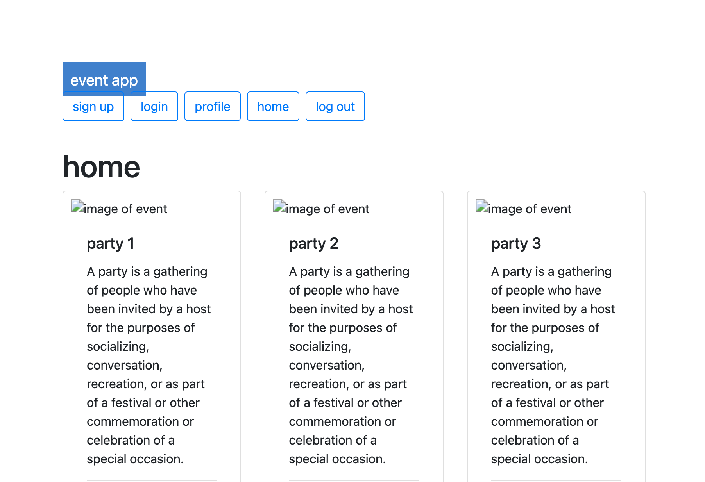
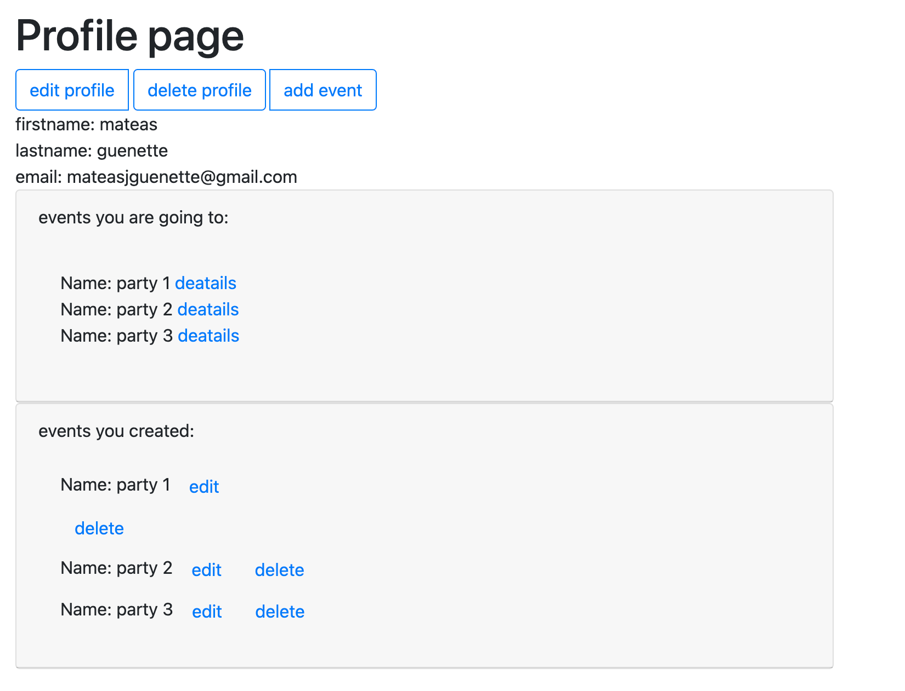

# **event app**

## Rules and General Overview

By using an event app, you can create events, organizers can keep track of the whereabouts of attendees, edit and delete your events. As a user you can decide wich events you want to attend, create a profile, edit it and delete it.

## Screenshots

## Technologies Used

- HTML
- CSS
- JavaScript
- mongodb
- heroku

## Play the Game

The web app can be accessed [here](https://eventappsei48.herokuapp.com/main)

## Future Work

- **access location**. This would allow you to see only the events happening in your city.

- **Making the app mobile friendly**. A mobile friendly app would allow you to see what's happening on the go.

- **accepting payments**. This would allow you to charge and receive money for your events .